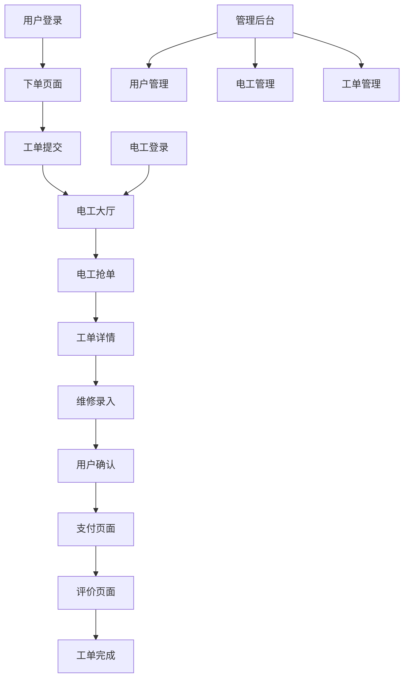

# 电工维修平台微信小程序产品需求文档

## 1. 产品概述
电工维修平台是一个基于微信小程序的O2O服务平台，连接有维修需求的用户和专业电工。用户可以在线下单，电工抢单接单，完成维修后在线支付和评价，实现维修服务的数字化闭环。

产品采用双角色设计，用户端和电工端统一在同一小程序内，通过角色识别加载不同的功能界面，提供便捷的维修服务体验。

## 2. 核心功能

### 2.1 用户角色
| 角色 | 注册方式 | 核心权限 |
|------|----------|----------|
| 普通用户 | 微信授权登录 + 手机号验证 | 下单、支付、评价、查看工单状态 |
| 电工用户 | 微信授权登录 + 实名认证（姓名、身份证号、电工证编号及有效期） | 接单、录入维修内容和金额、完成工单 |
| 管理员 | 后台账号登录 | 用户管理、电工管理、工单管理 |

### 2.2 功能模块
我们的电工维修平台包含以下主要页面：
1. **首页**：角色选择入口、服务介绍、快速下单入口
2. **用户端页面**：下单页面、工单列表、工单详情、支付页面、评价页面、个人中心
3. **电工端页面**：工单大厅、我的工单、工单详情、维修录入、个人中心
4. **通用页面**：登录注册、消息中心、客服页面
5. **管理后台**：用户管理、电工管理、工单管理

### 2.3 页面详情
| 页面名称 | 模块名称 | 功能描述 |
|----------|----------|----------|
| 首页 | 角色选择 | 用户选择身份（普通用户/电工），跳转对应功能页面 |
| 首页 | 服务介绍 | 展示平台服务内容、流程说明、联系方式 |
| 首页 | 快速下单 | 紧急维修快速入口，一键跳转下单页面 |
| 下单页面 | 基本信息 | 填写联系人、电话、地址、故障描述 |
| 下单页面 | 服务类型 | 选择紧急/常规维修，显示预估响应时间 |
| 下单页面 | 图片上传 | 上传故障现场照片，帮助电工了解情况 |
| 工单列表 | 工单状态 | 显示待接单、进行中、待支付、已完成等状态 |
| 工单列表 | 筛选排序 | 按时间、状态、类型筛选工单 |
| 工单详情 | 基本信息 | 显示工单详细信息、电工信息、进度状态 |
| 工单详情 | 实时沟通 | WebSocket实时消息，状态变更推送 |
| 工单详情 | 金额确认 | 用户确认电工录入的维修金额和内容 |
| 支付页面 | 微信支付 | 调用微信支付API，平台代收款项 |
| 支付页面 | 支付结果 | 显示支付状态，跳转评价页面 |
| 评价页面 | 星级评价 | 对电工服务进行1-5星评价 |
| 评价页面 | 文字评价 | 填写详细的服务评价内容 |
| 电工工单大厅 | 工单列表 | 显示可接单的工单，按距离和时间排序 |
| 电工工单大厅 | 抢单功能 | 一键抢单，先到先得机制 |
| 电工工单大厅 | 筛选功能 | 按距离、紧急程度、金额范围筛选 |
| 维修录入 | 维修内容 | 录入具体维修项目、使用材料、工时 |
| 维修录入 | 金额计算 | 录入维修费用，包含人工费和材料费 |
| 维修录入 | 现场照片 | 上传维修前后对比照片 |
| 个人中心 | 基本信息 | 显示用户/电工基本信息，支持编辑 |
| 个人中心 | 认证状态 | 电工显示认证状态，用户显示会员等级 |
| 个人中心 | 历史记录 | 查看历史工单、收入统计、评价记录 |
| 消息中心 | 系统消息 | 工单状态变更、系统通知 |
| 消息中心 | 订阅消息 | 微信订阅消息推送设置 |
| 管理后台 | 用户管理 | 用户列表、状态管理、数据统计 |
| 管理后台 | 电工管理 | 电工认证审核、状态管理、评价统计 |
| 管理后台 | 工单管理 | 工单列表、状态监控、异常处理 |

## 3. 核心流程

**用户下单流程：**
用户登录 → 选择服务类型 → 填写维修信息 → 上传现场照片 → 提交工单 → 等待电工接单 → 确认维修方案和金额 → 电工完成维修 → 在线支付 → 评价电工

**电工接单流程：**
电工登录 → 查看工单大厅 → 选择合适工单 → 抢单成功 → 联系用户确认 → 到场维修 → 录入维修内容和金额 → 等待用户确认 → 完成维修 → 获得收入

**管理员流程：**
管理员登录 → 审核电工认证 → 监控工单状态 → 处理用户投诉 → 查看平台数据统计

## 4. 用户界面设计

### 4.1 设计风格
- **主色调**：蓝色系（#1890FF主蓝色，#E6F7FF浅蓝色背景）
- **辅助色**：白色（#FFFFFF），灰色（#F5F5F5背景，#666666文字）
- **按钮样式**：圆角矩形，蓝色渐变背景，白色文字
- **字体**：微信小程序默认字体，标题16px，正文14px，辅助文字12px
- **布局风格**：卡片式设计，顶部导航，底部Tab栏
- **图标风格**：线性图标，蓝色主题，简洁现代

### 4.2 页面设计概览
| 页面名称 | 模块名称 | UI元素 |
|----------|----------|--------|
| 首页 | 角色选择 | 蓝色渐变背景，大按钮设计，图标+文字组合 |
| 首页 | 服务介绍 | 白色卡片，蓝色标题，灰色描述文字 |
| 下单页面 | 表单区域 | 白色背景，蓝色边框输入框，圆角设计 |
| 下单页面 | 图片上传 | 虚线边框，蓝色上传图标，点击上传 |
| 工单列表 | 工单卡片 | 白色卡片，蓝色状态标签，灰色分割线 |
| 工单详情 | 状态流程 | 蓝色进度条，圆形节点，完成状态高亮 |
| 支付页面 | 金额显示 | 大号蓝色数字，白色背景，居中对齐 |
| 评价页面 | 星级评价 | 黄色星星图标，蓝色选中状态 |
| 电工大厅 | 工单卡片 | 白色卡片，蓝色抢单按钮，距离标签 |
| 个人中心 | 头像区域 | 圆形头像，蓝色边框，白色背景 |

### 4.3 响应式设计
产品专为微信小程序设计，适配移动端屏幕，支持触摸交互优化。采用rpx单位确保在不同设备上的一致性显示，重要按钮区域增大触摸面积，提升用户体验。