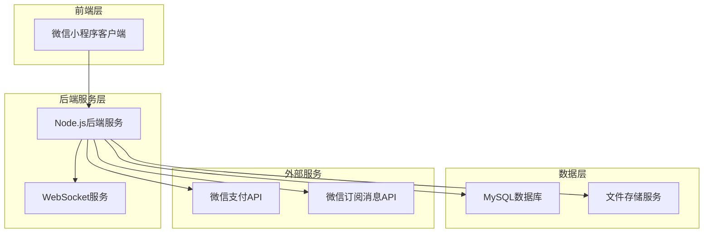
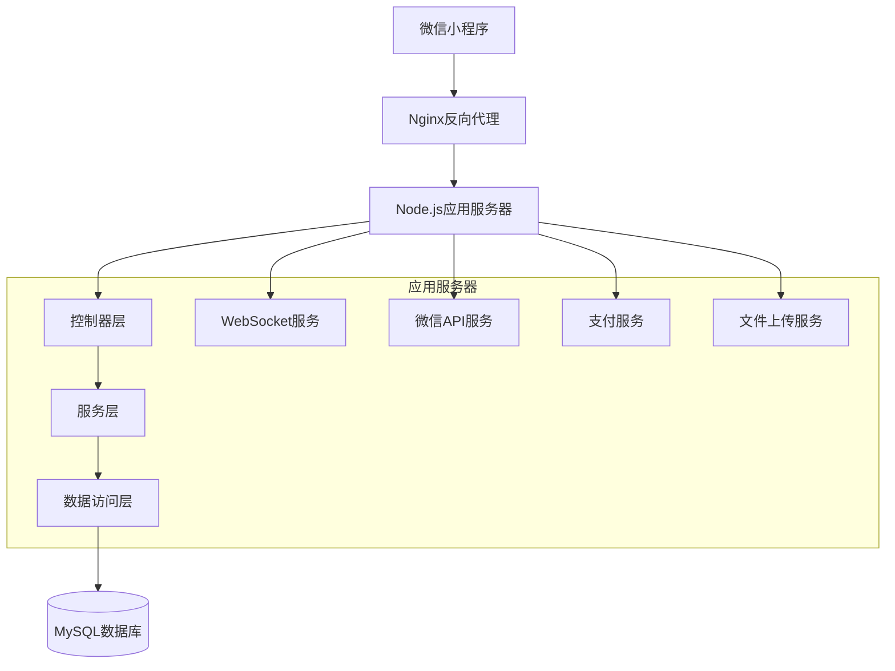
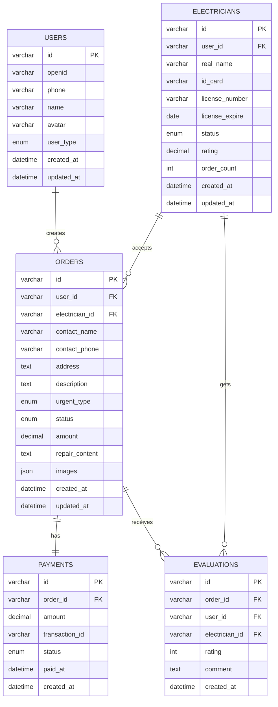

# 电工维修平台技术架构文档

## 1. 架构设计



## 2. 技术描述

* **前端**：微信小程序原生开发 + WeUI组件库

* **后端**：Node.js + Express.js + Socket.io

* **数据库**：MySQL 8.0

* **缓存**：Redis（可选，用于Session和实时数据）

* **文件存储**：腾讯云COS或阿里云OSS

* **支付**：微信支付API

* **消息推送**：WebSocket + 微信订阅消息

## 3. 路由定义

| 路由                              | 用途              |
| ------------------------------- | --------------- |
| /pages/index/index              | 首页，角色选择和服务介绍    |
| /pages/login/login              | 登录页面，微信授权和手机号验证 |
| /pages/user/order               | 用户下单页面          |
| /pages/user/orders              | 用户工单列表          |
| /pages/user/order-detail        | 用户工单详情          |
| /pages/user/payment             | 支付页面            |
| /pages/user/evaluate            | 评价页面            |
| /pages/user/profile             | 用户个人中心          |
| /pages/electrician/hall         | 电工工单大厅          |
| /pages/electrician/orders       | 电工工单列表          |
| /pages/electrician/order-detail | 电工工单详情          |
| /pages/electrician/repair-input | 维修内容录入          |
| /pages/electrician/profile      | 电工个人中心          |
| /pages/common/messages          | 消息中心            |
| /pages/common/customer-service  | 客服页面            |

## 4. API定义

### 4.1 用户认证相关

**微信登录**

```
POST /api/auth/wechat-login
```

请求参数：

| 参数名      | 参数类型   | 是否必填 | 描述     |
| -------- | ------ | ---- | ------ |
| code     | string | true | 微信授权码  |
| userInfo | object | true | 微信用户信息 |

响应参数：

| 参数名       | 参数类型    | 描述                     |
| --------- | ------- | ---------------------- |
| token     | string  | 用户认证令牌                 |
| userType  | string  | 用户类型（user/electrician） |
| isNewUser | boolean | 是否新用户                  |

**手机号绑定**

```
POST /api/auth/bind-phone
```

请求参数：

| 参数名         | 参数类型   | 是否必填 | 描述   |
| ----------- | ------ | ---- | ---- |
| phoneNumber | string | true | 手机号码 |
| verifyCode  | string | true | 验证码  |

### 4.2 工单管理相关

**创建工单**

```
POST /api/orders
```

请求参数：

| 参数名          | 参数类型   | 是否必填  | 描述                  |
| ------------ | ------ | ----- | ------------------- |
| contactName  | string | true  | 联系人姓名               |
| contactPhone | string | true  | 联系电话                |
| address      | string | true  | 维修地址                |
| description  | string | true  | 故障描述                |
| urgentType   | string | true  | 紧急程度（urgent/normal） |
| images       | array  | false | 现场照片URL数组           |

**获取工单列表**

```
GET /api/orders
```

请求参数：

| 参数名    | 参数类型   | 是否必填  | 描述        |
| ------ | ------ | ----- | --------- |
| status | string | false | 工单状态筛选    |
| page   | number | false | 页码，默认1    |
| limit  | number | false | 每页数量，默认10 |

**电工抢单**

```
POST /api/orders/:orderId/grab
```

### 4.3 支付相关

**创建支付订单**

```
POST /api/payments
```

请求参数：

| 参数名     | 参数类型   | 是否必填 | 描述      |
| ------- | ------ | ---- | ------- |
| orderId | string | true | 工单ID    |
| amount  | number | true | 支付金额（分） |

响应参数：

| 参数名           | 参数类型   | 描述     |
| ------------- | ------ | ------ |
| paymentParams | object | 微信支付参数 |

### 4.4 WebSocket配置与实现

**✅ WebSocket服务已启用**

**服务器端配置：**
- 技术栈：Socket.IO 4.7.4
- 主要配置文件：`api/app.js` (第21-26行)
- 服务实现文件：`api/services/socketService.js`
- 端口：3000 (与HTTP服务共用)

**客户端配置：**
- 连接管理：`miniprogram/utils/websocket.js`
- 配置文件：`miniprogram/utils/config.js`
- WebSocket地址：`ws://localhost:3000`

**认证机制：**
```javascript
// 服务器端认证中间件
io.use(async (socket, next) => {
  const token = socket.handshake.auth.token;
  const decoded = jwt.verify(token, jwtConfig.secret);
  socket.userId = decoded.userId;
  socket.userType = decoded.userType;
  next();
});
```

**支持的事件类型：**

**连接认证**
```
Event: auth
Data: { token: string }
```

**工单状态更新**
```
Event: order-status-update
Data: { orderId: string, status: string, message: string }
```

**新工单推送（电工）**
```
Event: new-order
Data: { orderId: string, orderInfo: object }
```

**位置更新（电工）**
```
Event: update_location
Data: { latitude: number, longitude: number }
```

**消息发送**
```
Event: send_message
Data: { type: string, target: string, content: string, orderId: string }
```

**心跳检测**
```
Event: heartbeat
Response: heartbeat_ack
```

## 5. 服务器架构图



## 6. 数据模型

### 6.1 数据模型定义



### 6.2 数据定义语言

**用户表（users）**

```sql
-- 创建用户表
CREATE TABLE users (
    id VARCHAR(32) PRIMARY KEY DEFAULT (REPLACE(UUID(), '-', '')),
    openid VARCHAR(100) UNIQUE NOT NULL COMMENT '微信openid',
    phone VARCHAR(20) UNIQUE COMMENT '手机号',
    name VARCHAR(50) COMMENT '用户姓名',
    avatar VARCHAR(500) COMMENT '头像URL',
    user_type ENUM('user', 'electrician') DEFAULT 'user' COMMENT '用户类型',
    created_at TIMESTAMP DEFAULT CURRENT_TIMESTAMP,
    updated_at TIMESTAMP DEFAULT CURRENT_TIMESTAMP ON UPDATE CURRENT_TIMESTAMP
);

-- 创建索引
CREATE INDEX idx_users_openid ON users(openid);
CREATE INDEX idx_users_phone ON users(phone);
```

**电工表（electricians）**

```sql
-- 创建电工表
CREATE TABLE electricians (
    id VARCHAR(32) PRIMARY KEY DEFAULT (REPLACE(UUID(), '-', '')),
    user_id VARCHAR(32) NOT NULL COMMENT '关联用户ID',
    real_name VARCHAR(50) NOT NULL COMMENT '真实姓名',
    id_card VARCHAR(20) NOT NULL COMMENT '身份证号',
    license_number VARCHAR(50) NOT NULL COMMENT '电工证编号',
    license_expire DATE NOT NULL COMMENT '电工证有效期',
    status ENUM('pending', 'approved', 'rejected', 'suspended') DEFAULT 'pending' COMMENT '认证状态',
    rating DECIMAL(3,2) DEFAULT 5.00 COMMENT '评分',
    order_count INT DEFAULT 0 COMMENT '完成订单数',
    created_at TIMESTAMP DEFAULT CURRENT_TIMESTAMP,
    updated_at TIMESTAMP DEFAULT CURRENT_TIMESTAMP ON UPDATE CURRENT_TIMESTAMP,
    FOREIGN KEY (user_id) REFERENCES users(id) ON DELETE CASCADE
);

-- 创建索引
CREATE INDEX idx_electricians_user_id ON electricians(user_id);
CREATE INDEX idx_electricians_status ON electricians(status);
CREATE INDEX idx_electricians_rating ON electricians(rating DESC);
```

**工单表（orders）**

```sql
-- 创建工单表
CREATE TABLE orders (
    id VARCHAR(32) PRIMARY KEY DEFAULT (REPLACE(UUID(), '-', '')),
    user_id VARCHAR(32) NOT NULL COMMENT '用户ID',
    electrician_id VARCHAR(32) COMMENT '电工ID',
    contact_name VARCHAR(50) NOT NULL COMMENT '联系人',
    contact_phone VARCHAR(20) NOT NULL COMMENT '联系电话',
    address TEXT NOT NULL COMMENT '维修地址',
    description TEXT NOT NULL COMMENT '故障描述',
    urgent_type ENUM('urgent', 'normal') DEFAULT 'normal' COMMENT '紧急程度',
    status ENUM('pending', 'accepted', 'confirmed', 'completed', 'paid', 'cancelled') DEFAULT 'pending' COMMENT '工单状态',
    amount DECIMAL(10,2) COMMENT '维修金额',
    repair_content TEXT COMMENT '维修内容',
    images JSON COMMENT '图片URLs',
    created_at TIMESTAMP DEFAULT CURRENT_TIMESTAMP,
    updated_at TIMESTAMP DEFAULT CURRENT_TIMESTAMP ON UPDATE CURRENT_TIMESTAMP,
    FOREIGN KEY (user_id) REFERENCES users(id) ON DELETE CASCADE,
    FOREIGN KEY (electrician_id) REFERENCES electricians(id) ON DELETE SET NULL
);

-- 创建索引
CREATE INDEX idx_orders_user_id ON orders(user_id);
CREATE INDEX idx_orders_electrician_id ON orders(electrician_id);
CREATE INDEX idx_orders_status ON orders(status);
CREATE INDEX idx_orders_created_at ON orders(created_at DESC);
CREATE INDEX idx_orders_urgent_type ON orders(urgent_type);
```

**支付表（payments）**

```sql
-- 创建支付表
CREATE TABLE payments (
    id VARCHAR(32) PRIMARY KEY DEFAULT (REPLACE(UUID(), '-', '')),
    order_id VARCHAR(32) NOT NULL COMMENT '工单ID',
    amount DECIMAL(10,2) NOT NULL COMMENT '支付金额',
    transaction_id VARCHAR(100) COMMENT '微信交易号',
    status ENUM('pending', 'paid', 'failed', 'refunded') DEFAULT 'pending' COMMENT '支付状态',
    paid_at TIMESTAMP NULL COMMENT '支付时间',
    created_at TIMESTAMP DEFAULT CURRENT_TIMESTAMP,
    FOREIGN KEY (order_id) REFERENCES orders(id) ON DELETE CASCADE
);

-- 创建索引
CREATE INDEX idx_payments_order_id ON payments(order_id);
CREATE INDEX idx_payments_status ON payments(status);
CREATE INDEX idx_payments_transaction_id ON payments(transaction_id);
```

**评价表（evaluations）**

```sql
-- 创建评价表
CREATE TABLE evaluations (
    id VARCHAR(32) PRIMARY KEY DEFAULT (REPLACE(UUID(), '-', '')),
    order_id VARCHAR(32) NOT NULL COMMENT '工单ID',
    user_id VARCHAR(32) NOT NULL COMMENT '用户ID',
    electrician_id VARCHAR(32) NOT NULL COMMENT '电工ID',
    rating INT NOT NULL CHECK (rating >= 1 AND rating <= 5) COMMENT '评分1-5星',
    comment TEXT COMMENT '评价内容',
    created_at TIMESTAMP DEFAULT CURRENT_TIMESTAMP,
    FOREIGN KEY (order_id) REFERENCES orders(id) ON DELETE CASCADE,
    FOREIGN KEY (user_id) REFERENCES users(id) ON DELETE CASCADE,
    FOREIGN KEY (electrician_id) REFERENCES electricians(id) ON DELETE CASCADE
);

-- 创建索引
CREATE INDEX idx_evaluations_order_id ON evaluations(order_id);
CREATE INDEX idx_evaluations_electrician_id ON evaluations(electrician_id);
CREATE INDEX idx_evaluations_rating ON evaluations(rating DESC);

-- 初始化数据
INSERT INTO users (openid, name, user_type) VALUES 
('test_admin_openid', '系统管理员', 'user'),
('test_user_openid', '测试用户', 'user'),
('test_electrician_openid', '测试电工', 'electrician');
```

