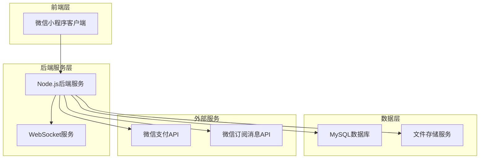
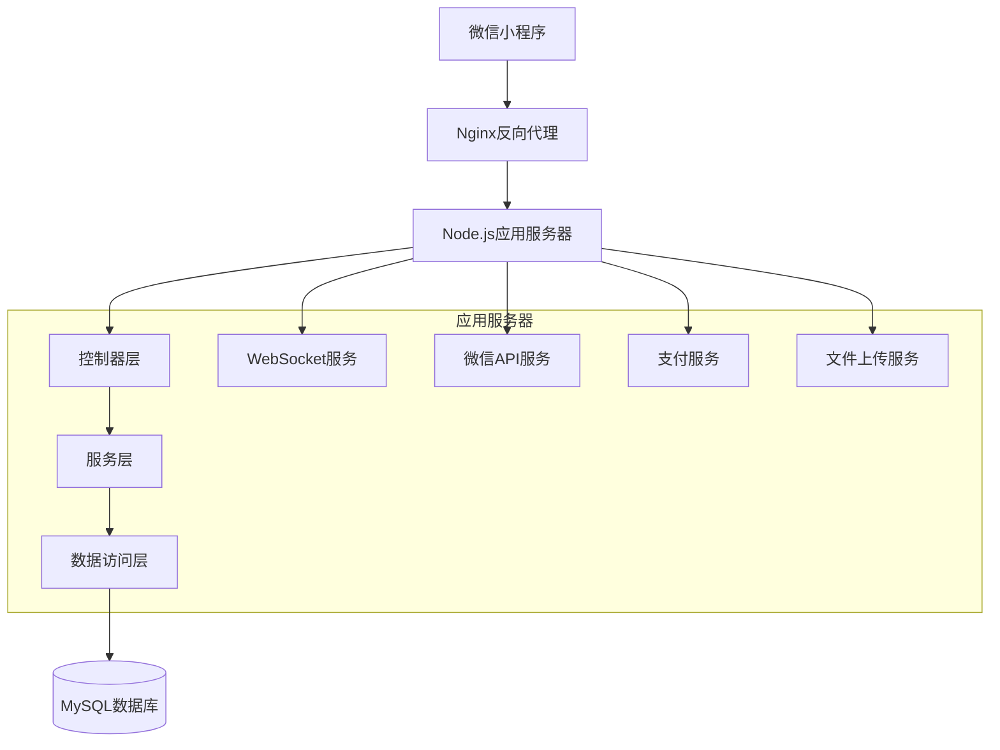

# 电工维修平台技术架构文档

## 1. 架构设计



## 2. 技术描述

* **前端**：微信小程序原生开发 + WeUI组件库

* **后端**：Node.js + Express.js + Socket.io

* **数据库**：MySQL 8.0

* **缓存**：Redis（可选，用于Session和实时数据）

* **文件存储**：腾讯云COS或阿里云OSS

* **支付**：微信支付API

* **消息推送**：WebSocket + 微信订阅消息

## 3. 路由定义

| 路由                              | 用途              |
| ------------------------------- | --------------- |
| /pages/index/index              | 首页，角色选择和服务介绍    |
| /pages/login/login              | 登录页面，微信授权和手机号验证 |
| /pages/user/order               | 用户下单页面          |
| /pages/user/orders              | 用户工单列表          |
| /pages/user/order-detail        | 用户工单详情          |
| /pages/user/payment             | 支付页面            |
| /pages/user/evaluate            | 评价页面            |
| /pages/user/profile             | 用户个人中心          |
| /pages/electrician/hall         | 电工工单大厅          |
| /pages/electrician/orders       | 电工工单列表          |
| /pages/electrician/order-detail | 电工工单详情          |
| /pages/electrician/repair-input | 维修内容录入          |
| /pages/electrician/profile      | 电工个人中心          |
| /pages/common/messages          | 消息中心            |
| /pages/common/customer-service  | 客服页面            |

## 4. API定义

### 4.1 用户认证相关

**微信登录**

```
POST /api/auth/wechat-login
```

请求参数：

| 参数名      | 参数类型   | 是否必填 | 描述     |
| -------- | ------ | ---- | ------ |
| code     | string | true | 微信授权码  |
| userInfo | object | true | 微信用户信息 |

响应参数：

| 参数名       | 参数类型    | 描述                     |
| --------- | ------- | ---------------------- |
| token     | string  | 用户认证令牌                 |
| userType  | string  | 用户类型（user/electrician） |
| isNewUser | boolean | 是否新用户                  |

**手机号绑定**

```
POST /api/auth/bind-phone
```

请求参数：

| 参数名         | 参数类型   | 是否必填 | 描述   |
| ----------- | ------ | ---- | ---- |
| phoneNumber | string | true | 手机号码 |
| verifyCode  | string | true | 验证码  |

### 4.2 工单管理相关

**创建工单**

```
POST /api/orders
```

请求参数：

| 参数名          | 参数类型   | 是否必填  | 描述                  |
| ------------ | ------ | ----- | ------------------- |
| contactName  | string | true  | 联系人姓名               |
| contactPhone | string | true  | 联系电话                |
| address      | string | true  | 维修地址                |
| description  | string | true  | 故障描述                |
| urgentType   | string | true  | 紧急程度（urgent/normal） |
| images       | array  | false | 现场照片URL数组           |

**获取工单列表**

```
GET /api/orders
```

请求参数：

| 参数名    | 参数类型   | 是否必填  | 描述        |
| ------ | ------ | ----- | --------- |
| status | string | false | 工单状态筛选    |
| page   | number | false | 页码，默认1    |
| limit  | number | false | 每页数量，默认10 |

**电工抢单**

```
POST /api/orders/:orderId/grab
```

### 4.3 支付相关

**创建支付订单**

```
POST /api/payments
```

请求参数：

| 参数名     | 参数类型   | 是否必填 | 描述      |
| ------- | ------ | ---- | ------- |
| orderId | string | true | 工单ID    |
| amount  | number | true | 支付金额（分） |

响应参数：

| 参数名           | 参数类型   | 描述     |
| ------------- | ------ | ------ |
| paymentParams | object | 微信支付参数 |

### 4.4 WebSocket配置与实现

**✅ WebSocket服务已启用**

**服务器端配置：**

* 技术栈：Socket.IO 4.7.4

* 主要配置文件：`api/app.js` (第21-26行)

* 服务实现文件：`api/services/socketService.js`

* 端口：3000 (与HTTP服务共用)

**客户端配置：**

* 连接管理：`miniprogram/utils/websocket.js`

* 配置文件：`miniprogram/utils/config.js`

* WebSocket地址：`ws://localhost:3000`

**认证机制：**

```javascript
// 服务器端认证中间件
io.use(async (socket, next) => {
  const token = socket.handshake.auth.token;
  const decoded = jwt.verify(token, jwtConfig.secret);
  socket.userId = decoded.userId;
  socket.userType = decoded.userType;
  next();
});
```

**支持的事件类型：**

**连接认证**

```
Event: auth
Data: { token: string }
```

**工单状态更新**

```
Event: order-status-update
Data: { orderId: string, status: string, message: string }
```

**新工单推送（电工）**

```
Event: new-order
Data: { orderId: string, orderInfo: object }
```

**位置更新（电工）**

```
Event: update_location
Data: { latitude: number, longitude: number }
```

**消息发送**

```
Event: send_message
Data: { type: string, target: string, content: string, orderId: string }
```

**心跳检测**

```
Event: heartbeat
Response: heartbeat_ack
```

## 5. 服务器架构图



## 6. 数据模型

### 6.1 数据模型定义

```mermaid
erDiagram
    USERS ||--o{ ORDERS : creates
    ELECTRICIANS ||--o{ ORDERS : accepts
    ORDERS ||--|| PAYMENTS : has
    ORDERS ||--o{ EVALUATIONS : receives
    ELECTRICIANS ||--o{ EVALUATIONS : gets
    
    USERS {
        int id PK
        varchar openid
        varchar unionid
        varchar phone
        varchar name
        varchar nickname
        varchar avatar
        enum gender
        enum user_type
        enum status
        varchar id_card
        varchar address
        varchar city
        varchar province
        datetime last_login_at
        datetime created_at
        datetime updated_at
    }
    
    ELECTRICIANS {
        int id PK
        int user_id FK
        varchar certificate_number
        enum certificate_type
        json certificate_images
        int experience_years
        json specialties
        json service_areas
        enum work_status
        enum verification_status
        text verification_note
        decimal rating
        int total_orders
        int completed_orders
        decimal total_earnings
        decimal current_latitude
        decimal current_longitude
        datetime location_updated_at
        boolean emergency_available
        decimal min_order_amount
        text introduction
        json work_images
        datetime created_at
        datetime updated_at
    }
    
    ORDERS {
        int id PK
        varchar order_no
        int user_id FK
        int electrician_id FK
        varchar title
        text description
        enum category
        enum priority
        enum status
        varchar contact_name
        varchar contact_phone
        varchar address
        decimal latitude
        decimal longitude
        json images
        decimal estimated_amount
        decimal quoted_amount
        decimal final_amount
        text quote_note
        text work_content
        json work_images
        json completion_images
        datetime scheduled_time
        datetime accepted_at
        datetime arrived_at
        datetime quoted_at
        datetime started_at
        datetime completed_at
        datetime cancelled_at
        varchar cancel_reason
        enum cancel_by
        int rating
        text rating_comment
        datetime rated_at
        enum payment_status
        enum payment_method
        varchar transaction_id
        datetime paid_at
        text notes
        datetime created_at
        datetime updated_at
    }
    
    PAYMENTS {
        int id PK
        varchar payment_no
        int order_id FK
        int user_id FK
        int electrician_id FK
        decimal amount
        decimal platform_fee
        decimal electrician_amount
        enum payment_method
        varchar payment_channel
        enum status
        varchar transaction_id
        varchar prepay_id
        varchar out_trade_no
        varchar trade_type
        varchar openid
        varchar bank_type
        enum settlement_status
        datetime settled_at
        decimal refund_amount
        varchar refund_reason
        datetime refunded_at
        json callback_data
        varchar notify_url
        varchar return_url
        datetime expire_time
        datetime paid_at
        varchar failed_reason
        int retry_count
        text notes
        datetime created_at
        datetime updated_at
    }
    
    REVIEWS {
        int id PK
        int order_id FK
        int user_id FK
        int electrician_id FK
        int rating
        int service_rating
        int skill_rating
        int punctuality_rating
        text comment
        json tags
        json images
        boolean is_anonymous
        boolean is_visible
        text reply_content
        datetime replied_at
        int helpful_count
        int report_count
        enum status
        datetime created_at
        datetime updated_at
    }
```



### 6.2 数据定义语言

**用户表（users）**

```sql
-- 创建用户表
CREATE TABLE users (
    id INT PRIMARY KEY AUTO_INCREMENT COMMENT '用户ID',
    openid VARCHAR(100) UNIQUE NOT NULL COMMENT '微信openid',
    unionid VARCHAR(100) COMMENT '微信unionid',
    phone VARCHAR(20) UNIQUE COMMENT '手机号码',
    name VARCHAR(50) COMMENT '真实姓名',
    nickname VARCHAR(50) COMMENT '微信昵称',
    avatar VARCHAR(500) COMMENT '头像URL',
    gender ENUM('male', 'female', 'unknown') DEFAULT 'unknown' COMMENT '性别',
    user_type ENUM('user', 'electrician', 'admin') DEFAULT 'user' COMMENT '用户类型',
    status ENUM('active', 'inactive', 'banned') DEFAULT 'active' COMMENT '账户状态',
    id_card VARCHAR(20) COMMENT '身份证号码',
    address VARCHAR(200) COMMENT '地址',
    city VARCHAR(50) COMMENT '城市',
    province VARCHAR(50) COMMENT '省份',
    last_login_at DATETIME COMMENT '最后登录时间',
    created_at DATETIME NOT NULL DEFAULT CURRENT_TIMESTAMP COMMENT '创建时间',
    updated_at DATETIME NOT NULL DEFAULT CURRENT_TIMESTAMP ON UPDATE CURRENT_TIMESTAMP COMMENT '更新时间'
) ENGINE=InnoDB DEFAULT CHARSET=utf8mb4 COLLATE=utf8mb4_unicode_ci;

-- 创建索引
CREATE INDEX idx_users_openid ON users(openid);
CREATE INDEX idx_users_phone ON users(phone);
CREATE INDEX idx_users_user_type ON users(user_type);
CREATE INDEX idx_users_status ON users(status);
CREATE INDEX idx_users_city ON users(city);
```

**电工表（electricians）**

```sql
-- 创建电工表
CREATE TABLE electricians (
    id INT PRIMARY KEY AUTO_INCREMENT COMMENT '电工ID',
    user_id INT NOT NULL UNIQUE COMMENT '关联用户ID',
    certificate_number VARCHAR(50) NOT NULL UNIQUE COMMENT '电工证编号',
    certificate_type ENUM('low_voltage', 'high_voltage', 'special') NOT NULL COMMENT '电工证类型',
    certificate_images JSON COMMENT '电工证照片URLs',
    experience_years INT NOT NULL DEFAULT 0 COMMENT '从业年限',
    specialties JSON COMMENT '专业技能领域',
    service_areas JSON COMMENT '服务区域',
    work_status ENUM('available', 'busy', 'offline') DEFAULT 'offline' COMMENT '工作状态',
    verification_status ENUM('pending', 'approved', 'rejected') DEFAULT 'pending' COMMENT '认证状态',
    verification_note TEXT COMMENT '审核备注',
    rating DECIMAL(3,2) DEFAULT 5.00 COMMENT '评分（1-5分）',
    total_orders INT DEFAULT 0 COMMENT '总接单数',
    completed_orders INT DEFAULT 0 COMMENT '完成订单数',
    total_earnings DECIMAL(10,2) DEFAULT 0.00 COMMENT '总收入',
    current_latitude DECIMAL(10,8) COMMENT '当前纬度',
    current_longitude DECIMAL(11,8) COMMENT '当前经度',
    location_updated_at DATETIME COMMENT '位置更新时间',
    emergency_available BOOLEAN DEFAULT FALSE COMMENT '是否接受紧急工单',
    min_order_amount DECIMAL(8,2) DEFAULT 50.00 COMMENT '最低接单金额',
    introduction TEXT COMMENT '个人介绍',
    work_images JSON COMMENT '工作照片展示',
    created_at DATETIME NOT NULL DEFAULT CURRENT_TIMESTAMP COMMENT '创建时间',
    updated_at DATETIME NOT NULL DEFAULT CURRENT_TIMESTAMP ON UPDATE CURRENT_TIMESTAMP COMMENT '更新时间',
    FOREIGN KEY (user_id) REFERENCES users(id) ON DELETE CASCADE
) ENGINE=InnoDB DEFAULT CHARSET=utf8mb4 COLLATE=utf8mb4_unicode_ci;

-- 创建索引
CREATE INDEX idx_electricians_user_id ON electricians(user_id);
CREATE INDEX idx_electricians_certificate_number ON electricians(certificate_number);
CREATE INDEX idx_electricians_verification_status ON electricians(verification_status);
CREATE INDEX idx_electricians_work_status ON electricians(work_status);
CREATE INDEX idx_electricians_rating ON electricians(rating DESC);
CREATE INDEX idx_electricians_location ON electricians(current_latitude, current_longitude);
CREATE INDEX idx_electricians_emergency_available ON electricians(emergency_available);
```

**工单表（orders）**

```sql
-- 创建工单表
CREATE TABLE orders (
    id INT PRIMARY KEY AUTO_INCREMENT COMMENT '工单ID',
    order_no VARCHAR(20) UNIQUE NOT NULL COMMENT '工单编号',
    user_id INT NOT NULL COMMENT '用户ID',
    electrician_id INT COMMENT '电工ID',
    title VARCHAR(100) NOT NULL COMMENT '工单标题',
    description TEXT NOT NULL COMMENT '故障描述',
    fault_type ENUM('circuit', 'appliance', 'lighting', 'installation', 'maintenance', 'emergency', 'other') NOT NULL COMMENT '故障类型',
    priority ENUM('low', 'medium', 'high', 'urgent') DEFAULT 'medium' COMMENT '优先级',
    status ENUM('pending', 'accepted', 'in_progress', 'completed', 'cancelled', 'expired') DEFAULT 'pending' COMMENT '工单状态',
    contact_phone VARCHAR(20) NOT NULL COMMENT '联系电话',
    contact_name VARCHAR(50) COMMENT '联系人姓名',
    address VARCHAR(200) NOT NULL COMMENT '服务地址',
    latitude DECIMAL(10,8) COMMENT '纬度',
    longitude DECIMAL(11,8) COMMENT '经度',
    images JSON COMMENT '故障图片URLs',
    estimated_amount DECIMAL(8,2) COMMENT '预估金额',
    quoted_amount DECIMAL(8,2) COMMENT '报价金额',
    actual_amount DECIMAL(8,2) COMMENT '实际金额',
    repair_content TEXT COMMENT '维修内容描述',
    repair_images JSON COMMENT '维修完成图片URLs',
    scheduled_at DATETIME COMMENT '预约服务时间',
    accepted_at DATETIME COMMENT '接单时间',
    started_at DATETIME COMMENT '开始服务时间',
    completed_at DATETIME COMMENT '完成时间',
    cancelled_at DATETIME COMMENT '取消时间',
    cancel_reason TEXT COMMENT '取消原因',
    cancel_by ENUM('user', 'electrician', 'system') COMMENT '取消方',
    rating INT COMMENT '用户评分（1-5分）',
    payment_status ENUM('unpaid', 'paid', 'refunded', 'partial_refund') DEFAULT 'unpaid' COMMENT '支付状态',
    payment_method ENUM('wechat', 'alipay', 'cash', 'bank_transfer') COMMENT '支付方式',
    transaction_id VARCHAR(100) COMMENT '支付交易号',
    paid_at DATETIME COMMENT '支付时间',
    notes TEXT COMMENT '备注信息',
    created_at DATETIME NOT NULL DEFAULT CURRENT_TIMESTAMP COMMENT '创建时间',
    updated_at DATETIME NOT NULL DEFAULT CURRENT_TIMESTAMP ON UPDATE CURRENT_TIMESTAMP COMMENT '更新时间',
    FOREIGN KEY (user_id) REFERENCES users(id) ON DELETE CASCADE,
    FOREIGN KEY (electrician_id) REFERENCES electricians(id) ON DELETE SET NULL
) ENGINE=InnoDB DEFAULT CHARSET=utf8mb4 COLLATE=utf8mb4_unicode_ci;

-- 创建索引
CREATE UNIQUE INDEX idx_orders_order_no ON orders(order_no);
CREATE INDEX idx_orders_user_id ON orders(user_id);
CREATE INDEX idx_orders_electrician_id ON orders(electrician_id);
CREATE INDEX idx_orders_status ON orders(status);
CREATE INDEX idx_orders_fault_type ON orders(fault_type);
CREATE INDEX idx_orders_priority ON orders(priority);
CREATE INDEX idx_orders_payment_status ON orders(payment_status);
CREATE INDEX idx_orders_created_at ON orders(created_at DESC);
CREATE INDEX idx_orders_location ON orders(latitude, longitude);
CREATE INDEX idx_orders_scheduled_at ON orders(scheduled_at);
```

**支付表（payments）**

```sql
-- 创建评价表
CREATE TABLE reviews (
    id INT PRIMARY KEY AUTO_INCREMENT COMMENT '评价ID',
    order_id INT NOT NULL UNIQUE COMMENT '关联工单ID',
    user_id INT NOT NULL COMMENT '用户ID',
    electrician_id INT NOT NULL COMMENT '电工ID',
    service_rating INT NOT NULL COMMENT '服务态度评分（1-5分）',
    quality_rating INT NOT NULL COMMENT '服务质量评分（1-5分）',
    speed_rating INT NOT NULL COMMENT '响应速度评分（1-5分）',
    overall_rating DECIMAL(3,2) NOT NULL COMMENT '综合评分（1-5分）',
    content TEXT COMMENT '评价内容',
    tags JSON COMMENT '评价标签',
    images JSON COMMENT '评价图片URLs',
    is_anonymous BOOLEAN DEFAULT FALSE COMMENT '是否匿名评价',
    reply_content TEXT COMMENT '电工回复内容',
    reply_at DATETIME COMMENT '回复时间',
    helpful_count INT DEFAULT 0 COMMENT '有用数',
    report_count INT DEFAULT 0 COMMENT '举报数',
    status ENUM('normal', 'hidden', 'deleted') DEFAULT 'normal' COMMENT '评价状态',
    created_at DATETIME NOT NULL DEFAULT CURRENT_TIMESTAMP COMMENT '创建时间',
    updated_at DATETIME NOT NULL DEFAULT CURRENT_TIMESTAMP ON UPDATE CURRENT_TIMESTAMP COMMENT '更新时间',
    FOREIGN KEY (order_id) REFERENCES orders(id) ON DELETE CASCADE,
    FOREIGN KEY (user_id) REFERENCES users(id) ON DELETE CASCADE,
    FOREIGN KEY (electrician_id) REFERENCES electricians(id) ON DELETE CASCADE
) ENGINE=InnoDB DEFAULT CHARSET=utf8mb4 COLLATE=utf8mb4_unicode_ci;

-- 创建索引
CREATE UNIQUE INDEX idx_reviews_order_id ON reviews(order_id);
CREATE INDEX idx_reviews_user_id ON reviews(user_id);
CREATE INDEX idx_reviews_electrician_id ON reviews(electrician_id);
CREATE INDEX idx_reviews_overall_rating ON reviews(overall_rating DESC);
CREATE INDEX idx_reviews_status ON reviews(status);
CREATE INDEX idx_reviews_created_at ON reviews(created_at DESC);
CREATE INDEX idx_reviews_is_anonymous ON reviews(is_anonymous);

-- 初始化数据
INSERT INTO users (openid, name, user_type) VALUES 
('test_admin_openid', '系统管理员', 'user'),
('test_user_openid', '测试用户', 'user'),
('test_electrician_openid', '测试电工', 'electrician');
```

**评价表（reviews）**

```sql
-- 创建评价表
CREATE TABLE reviews (
    id INT PRIMARY KEY AUTO_INCREMENT COMMENT '评价ID',
    order_id INT NOT NULL UNIQUE COMMENT '关联工单ID',
    user_id INT NOT NULL COMMENT '用户ID',
    electrician_id INT NOT NULL COMMENT '电工ID',
    service_rating INT NOT NULL COMMENT '服务态度评分（1-5分）',
    quality_rating INT NOT NULL COMMENT '服务质量评分（1-5分）',
    speed_rating INT NOT NULL COMMENT '响应速度评分（1-5分）',
    overall_rating DECIMAL(3,2) NOT NULL COMMENT '综合评分（1-5分）',
    content TEXT COMMENT '评价内容',
    tags JSON COMMENT '评价标签',
    images JSON COMMENT '评价图片URLs',
    is_anonymous BOOLEAN DEFAULT FALSE COMMENT '是否匿名评价',
    reply_content TEXT COMMENT '电工回复内容',
    reply_at DATETIME COMMENT '回复时间',
    helpful_count INT DEFAULT 0 COMMENT '有用数',
    report_count INT DEFAULT 0 COMMENT '举报数',
    status ENUM('normal', 'hidden', 'deleted') DEFAULT 'normal' COMMENT '评价状态',
    created_at DATETIME NOT NULL DEFAULT CURRENT_TIMESTAMP COMMENT '创建时间',
    updated_at DATETIME NOT NULL DEFAULT CURRENT_TIMESTAMP ON UPDATE CURRENT_TIMESTAMP COMMENT '更新时间',
    FOREIGN KEY (order_id) REFERENCES orders(id) ON DELETE CASCADE,
    FOREIGN KEY (user_id) REFERENCES users(id) ON DELETE CASCADE,
    FOREIGN KEY (electrician_id) REFERENCES electricians(id) ON DELETE CASCADE
) ENGINE=InnoDB DEFAULT CHARSET=utf8mb4 COLLATE=utf8mb4_unicode_ci;

-- 创建索引
CREATE UNIQUE INDEX idx_reviews_order_id ON reviews(order_id);
CREATE INDEX idx_reviews_user_id ON reviews(user_id);
CREATE INDEX idx_reviews_electrician_id ON reviews(electrician_id);
CREATE INDEX idx_reviews_overall_rating ON reviews(overall_rating DESC);
CREATE INDEX idx_reviews_status ON reviews(status);
CREATE INDEX idx_reviews_created_at ON reviews(created_at DESC);
CREATE INDEX idx_reviews_is_anonymous ON reviews(is_anonymous);

-- 初始化数据
INSERT INTO users (openid, name, user_type) VALUES 
('test_admin_openid', '系统管理员', 'user'),
('test_user_openid', '测试用户', 'user'),
('test_electrician_openid', '测试电工', 'electrician');
```

